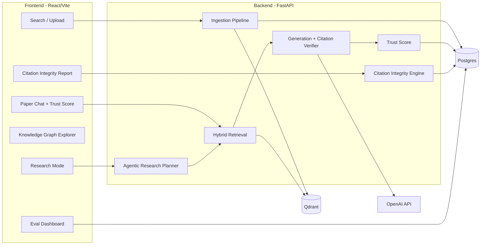

# PaperMind

A RAG system for research papers that does more than "chat with your PDF." PaperMind checks whether a
paper's citations actually say what the paper claims they say, turns a broad question into a
multi-paper literature review with a comparison table, and attaches a calibrated trust score to every
answer so it can abstain instead of confidently guessing.

Live demo: _add your deployed URL here once it's up_
Demo video: _add a short screen recording here_

## Why this exists

Most "RAG for papers" projects stop at: chunk a PDF, embed it, answer questions with citations. That's
necessary, but it's also something a dozen existing tools already do (ChatPDF, Elicit, SciSpace,
NotebookLM). This project keeps that core and builds three things on top of it that those tools don't do:

1. **Citation Integrity Engine.** For every in-text citation in a paper, extract the claim being made
   about the cited work, find the cited work's actual passage, and have an LLM judge whether the claim
   is supported, overstated, or contradicted. Also scans the whole corpus for papers that make
   contradictory claims about the same topic.
2. **Agentic Research Mode.** A broad question gets decomposed into sub-questions, retrieved across
   multiple papers, self-critiqued for coverage, and synthesized into a narrative literature review plus
   an auto-generated comparison table (method / dataset / metric / limitations). The reasoning trace is
   visible in the UI, not hidden.
3. **Calibrated trust score.** Every answer ships with a 0-100 score built from retrieval margin,
   reranker confidence, citation verification, and self-consistency across repeated generations. Below a
   threshold, the system says so and abstains rather than answering confidently anyway.

## Architecture



See [backend/app](backend/app) for the module layout, it mirrors this diagram directly: `ingestion/`,
`retrieval/`, `generation/`, `integrity/`, `graph/`, `agent/`, `trust/`, `eval/`.

## Running it locally

Requires Docker, Python 3.12, Node 20+, and an OpenAI API key.

```bash
cp backend/.env.example backend/.env   # fill in OPENAI_API_KEY
cd infra
docker compose up -d postgres qdrant
cd ../backend
python -m venv .venv && source .venv/bin/activate
pip install -r requirements.txt
uvicorn app.main:app --reload

# in another terminal
cd frontend
npm install
npm run dev
```

The frontend runs at `http://localhost:5173` and proxies `/api` to the backend at `http://localhost:8000`.

To try it out: go to Search, ingest a couple of papers from arXiv (e.g. `1706.03762` for "Attention Is
All You Need"), then use Chat, Citation Integrity, or Research Mode against them.

To seed a small known corpus for the eval suite:

```bash
cd backend
python scripts/seed_corpus.py
python -m app.eval.eval_runner
```

## Running the full stack with Docker

```bash
cd infra
OPENAI_API_KEY=sk-... docker compose up --build
```

## Deployment

- Frontend: Vercel. Set `VITE_API_BASE_URL` to the deployed backend URL.
- Backend: Render (see [render.yaml](render.yaml)) or Fly.io, built from [backend/Dockerfile](backend/Dockerfile).
- Vector store: Qdrant Cloud free tier.
- Postgres: Supabase free tier.

## Eval harness and CI

[backend/app/eval](backend/app/eval) runs the real pipeline (retrieval, reranking, generation, citation
verification) against a small seed question set and records retrieval hit-rate/MRR, answer correctness,
and citation pass rate. [infra/.github/workflows/ci.yml](infra/.github/workflows/ci.yml) runs this on
every PR that touches retrieval/generation code, and nightly on a schedule so the Eval Dashboard shows a
real trend line instead of a single snapshot. Thumbs-down feedback on high-trust-score answers is flagged
(see [app/feedback/feedback_store.py](backend/app/feedback/feedback_store.py)) as a candidate to add to the
eval set.

The seed eval set in [eval_dataset.json](backend/app/eval/eval_dataset.json) is intentionally small, the
point of this harness is the pipeline (automatic metrics, CI gating, a dashboard that updates over time),
not an exhaustive benchmark. It's meant to grow as real usage comes in.

## Design decisions worth knowing about

- **Hybrid search over pure vector search.** Qdrant's native dense + sparse (BM25) fusion catches exact
  terminology matches (model names, dataset names) that a purely semantic embedding sometimes misses.
- **LLM-as-reranker instead of a hosted cross-encoder.** A cross-encoder model is marginally faster, but
  it means shipping a few hundred MB of model weights and a torch dependency for one step. For the
  traffic volume this project actually sees, asking the generation model to score relevance is simpler to
  deploy and good enough. This would be worth revisiting if traffic grew.
- **Knowledge graph as Postgres adjacency tables, not a separate graph database.** The corpus size this
  project targets (dozens to low hundreds of papers) doesn't need Neo4j-scale graph queries. Plain tables
  plus in-process `networkx` traversal keep the whole thing on free-tier infra without adding another
  service to run and pay for.
- **Custom eval metrics instead of the `ragas` library.** `ragas` is well known, but it pulls in a large
  dependency tree (langchain, datasets, pandas) for metrics that are straightforward to compute directly
  against this pipeline's own output. The citation-integrity and trust-calibration metrics this project
  needs don't exist in `ragas` anyway.
- **Trust score weighting favors citation accuracy over raw retrieval confidence**, because a confidently
  worded answer that misquotes its sources is the failure mode that actually matters for a research tool,
  more than a slightly-off retrieval ranking does.

## What's not done yet

This is a from-scratch build and some pieces are deliberately left for iteration rather than gold-plated
up front:

- The frontend was written without a local Node.js runtime available in the build environment, so it
  has not been run through `npm install` / `npm run build` yet. Run that locally before deploying.
- The contradiction detector does an all-pairs comparison within a similarity threshold, which is fine
  for a small corpus but would need batching/indexing to scale past a few hundred papers.
- Authentication isn't implemented. For a portfolio demo with a small, trusted audience that's an
  acceptable scope cut, it would be a required addition before any real multi-user deployment.
