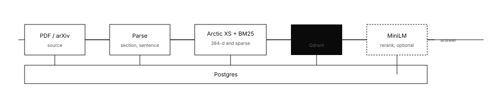

# PaperMind

Retrieval over a library of papers: hybrid search, citation checks, and a trust score that can abstain.

Live: [thepapermind.vercel.app](https://thepapermind.vercel.app)
API: [papermind-api-laof.onrender.com/docs](https://papermind-api-laof.onrender.com/docs)

Dense retrieval uses Snowflake Arctic Embed XS (int8 ONNX, 384-d). Sparse retrieval uses BM25, with IDF applied in Qdrant. The two lists are fused with reciprocal rank fusion. A MiniLM cross-encoder can rerank that list. On the public API the reranker stays unloaded: two ONNX sessions do not fit in 512 MB. Set `LOW_MEMORY=false` locally to load it.

Generation is optional. Any OpenAI-compatible chat endpoint works (`LLM_API_KEY`, or `OPENAI_API_KEY`, and `LLM_BASE_URL` for Groq, Together, OpenRouter, or Ollama). If the call fails or no key is set, chat returns the ranked passages as quotations.



## Models

| Role | Model | Notes |
| --- | --- | --- |
| Dense | `Snowflake/snowflake-arctic-embed-xs` int8 | 23 MB, 384-d, query prefix. Cosine vs fp32 about 0.998. |
| Sparse | `Qdrant/bm25` | Document term frequencies. Queries use `query_embed`. |
| Rerank | `Xenova/ms-marco-MiniLM-L-6-v2` int8 | Top fused hits. Off when `LOW_MEMORY=true`. |
| Generate | `gpt-4o-mini` by default | Remote. Not required for search. |

Keys are `arctic-embed-xs-int8` and `ms-marco-minilm-l6-int8` in `backend/app/ml/registry.py`. The Qdrant collection name includes the embedder and dimension.

Chunking follows section boundaries and sentence ends, with a short overlap. Repeated PDF headers are dropped and hyphenated line breaks are joined. The same arXiv id is not ingested twice. Bibliography entries link to other library papers by arXiv id, then by title.

## Trust

The score is 0 to 100.

| Signal | Meaning |
| --- | --- |
| Retrieval margin | Gap between the top hit and the next paper |
| Rerank confidence | Sigmoid of the MiniLM logit, or 0.5 if rerank is off |
| Citation pass rate | Share of generated citations supported by the cited passage. 1.0 for quotations |
| Self-consistency | Token overlap with a second sample, when generation ran |

Below the threshold the response is marked abstained.

## Evaluation

`backend/app/eval/` scores the same 10 questions four ways: dense, BM25, hybrid RRF, hybrid plus rerank. Metrics are MRR, Hit@5, and nDCG@10. The seed papers are Attention (`1706.03762`), BERT (`1810.04805`), and GPT-3 (`2005.14165`).

| Stage | MRR | Hit@5 | nDCG@10 |
| --- | --- | --- | --- |
| Dense | 1.00 | 1.00 | 1.00 |
| BM25 | 1.00 | 1.00 | 1.00 |
| Hybrid | 1.00 | 1.00 | 1.00 |
| Hybrid + rerank | 0.95 | 1.00 | 0.96 |

First-stage retrieval already separates these three papers. The reranker reordered one question. The public API, with the reranker off, matches the hybrid row.

## Run

Python 3.12+, Node 20+, Docker.

```bash
git clone https://github.com/sanjitchitturi/papermind.git
cd papermind
cp backend/.env.example backend/.env
make infra
```

```bash
cd backend
python -m venv .venv && source .venv/bin/activate
pip install -r requirements.txt
alembic upgrade head
make seed
uvicorn app.main:app --reload
```

```bash
cd frontend
npm install
npm run dev
```

Open `http://localhost:5173`. The dev server proxies `/api` to port 8000.

| Page | No key | With a working key |
| --- | --- | --- |
| Library | arXiv search, PDF upload | same |
| Chat | Quoted passages and a trust score | Cited prose |
| Integrity | Asks for a key | Citation verdicts, contradiction scan |
| Graph | Entities and citation edges | same |
| Research | Retrieved passages and a comparison table | Short review plus the table |
| Evaluation | Four retrieval ablations | Generation suite as well |

```bash
make test
make eval
```

## API

| Method | Path |
| --- | --- |
| GET | `/health` |
| GET | `/capabilities` |
| GET | `/papers` |
| DELETE | `/papers/{id}` |
| POST | `/ingest/arxiv/search` |
| POST | `/ingest/arxiv` |
| POST | `/ingest/upload` |
| GET | `/ingest/jobs/{id}` |
| POST | `/chat` |
| POST | `/integrity/papers/{id}/check` |
| GET | `/graph` |
| POST | `/research` |
| POST | `/eval/run?suite=retrieval` |
| GET | `/eval/history` |

Full schemas are at `/docs`.

## Deploy

Frontend: Vercel, root directory `frontend`, `VITE_API_BASE_URL` set to the API origin.

API: `backend/Dockerfile` (see `render.yaml`). Postgres should be reached through an IPv4 pooler. The direct Supabase hostname is IPv6-only on the free tier. Qdrant needs `QDRANT_URL` and `QDRANT_API_KEY`.

Production env that fits 512 MB:

```
EMBEDDING_MODEL=arctic-embed-xs-int8
RERANKER_MODEL=none
LOW_MEMORY=true
ML_BATCH_SIZE=1
LLM_MODEL=gpt-4o-mini
```

Migrations run on startup. A free Render instance sleeps after about 15 minutes.

## Layout

```
backend/app/api          routes
backend/app/core         settings, jobs, LLM client, Qdrant
backend/app/ingestion    PDF, arXiv, chunking
backend/app/ml           ONNX registry, embedder, reranker
backend/app/retrieval    hybrid search
backend/app/generation   answers and citation checks
backend/app/integrity    claims and contradictions
backend/app/graph        entities and citation edges
backend/app/agent        research mode
backend/app/eval         dataset and ablations
backend/app/trust        score
frontend/src             interface
infra                    Postgres and Qdrant
```

## License

MIT. See [LICENSE](LICENSE).
